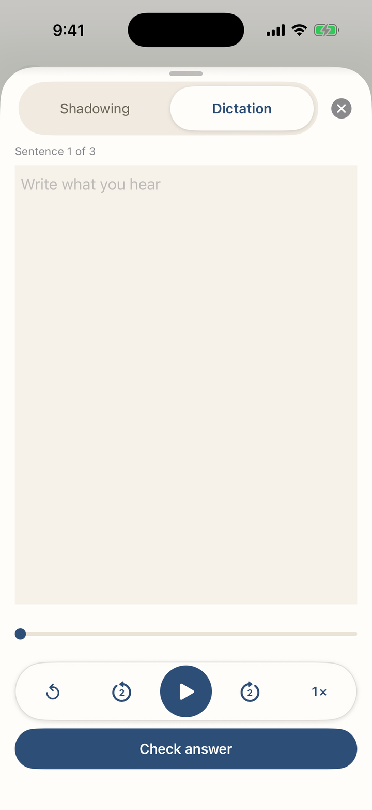
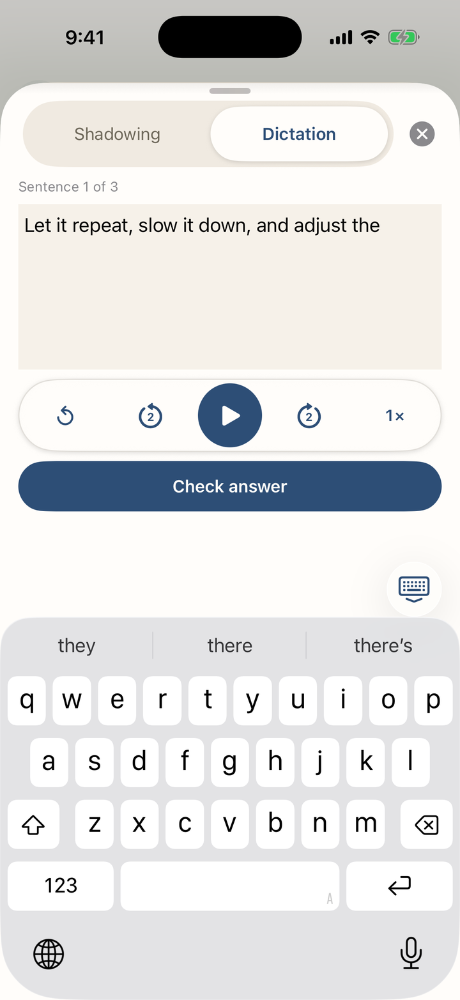
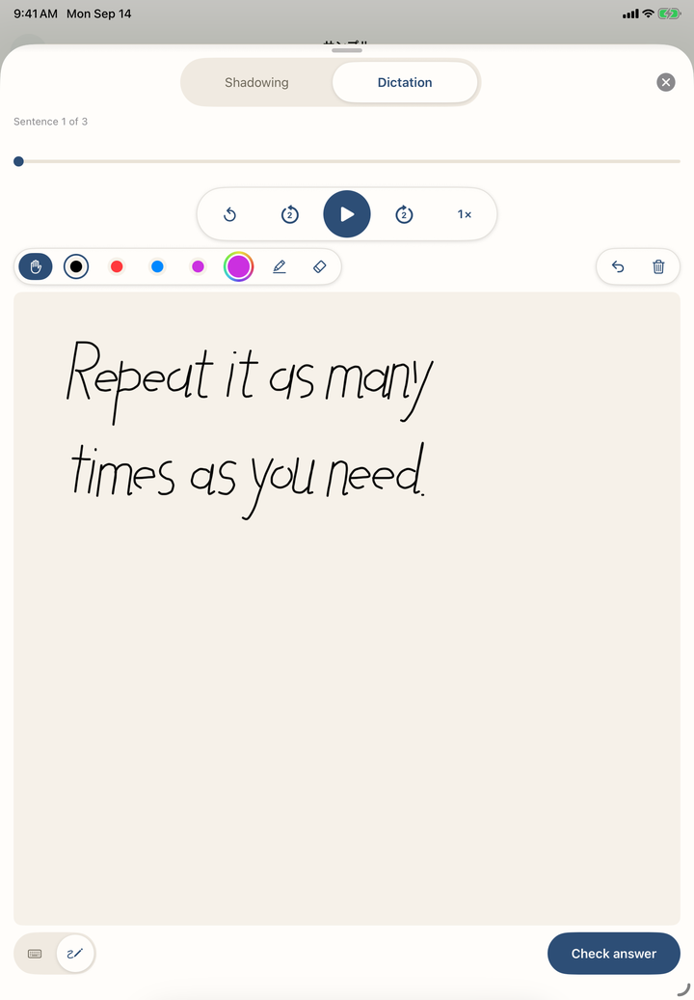
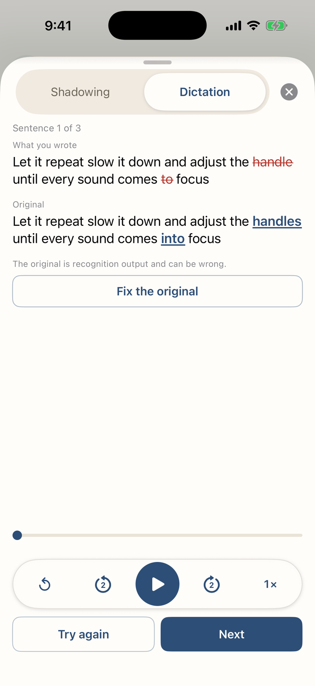
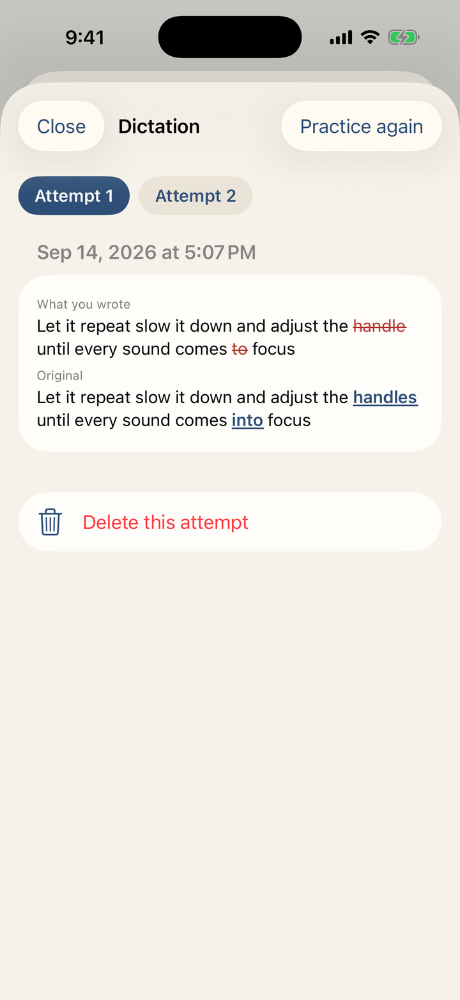

# Phrabbit User Guide

Phrabbit is an A/B loop app for foreign-language listening practice. Add audio files, video files, Music library tracks, podcasts, or YouTube links as study material, then repeat the exact section you want to hear, shadow it with your own voice, or write it down in dictation. You can also use speech-to-text subtitles, Wordbook review, saved shadowing recordings and dictation attempts, and learning stats.

> Note: Button names in this guide follow the English UI used in the app. Some labels may appear localized depending on your device language.

## Contents

1. [Getting Started](#1-getting-started)
2. [Home and Library](#2-home-and-library)
3. [Adding Study Material](#3-adding-study-material)
4. [Audio Player](#4-audio-player)
5. [A/B Loop](#5-ab-loop)
6. [Bookmarks and Loop Lists](#6-bookmarks-and-loop-lists)
7. [Speech-to-Text (STT) Subtitles](#7-speech-to-text-stt-subtitles)
8. [Editing, Translating, and Adding Subtitles](#8-editing-translating-and-adding-subtitles)
9. [Wordbook](#9-wordbook)
10. [YouTube Stream Practice](#10-youtube-stream-practice)
11. [Video Files](#11-video-files)
12. [Shadowing Recording and Comparison](#12-shadowing-recording-and-comparison)
13. [Dictation](#13-dictation)
14. [Podcasts](#14-podcasts)
15. [Learning Stats and Settings](#15-learning-stats-and-settings)
16. [Free vs Premium](#16-free-vs-premium)
17. [FAQ](#17-faq)

## 1. Getting Started

### 1-1. First Launch - Onboarding
When you open Phrabbit for the first time, onboarding introduces the basic flow.

1. **Waveform and A/B looping** - See the audio visually, set point A and point B, and repeat just that section.
2. **Subtitles, Wordbook, and review** - Read subtitles, save words you want to remember, and build a learning history.

On the last screen you can choose one of two actions.

| Button | Description |
|---|---|
| **Try with a sample** | Opens a sample audio file and walks through the player tutorial |
| **Skip** | Goes directly to the Home screen |

### 1-2. Free Trial
After onboarding, a **3-day free trial** begins. During the trial, you can try Premium features freely. While the trial is active, a **Trial** banner appears near the top of the player, and tapping it opens the Premium purchase screen.

## 2. Home and Library

The Home screen collects all study material you have added. Local audio, video files, Music library tracks, podcast episodes, and YouTube links appear together in the same library list.

*▲ Home screen showing files, podcasts, and YouTube items together*

### 2-1. Screen Layout

| Location | Element | Description |
|---|---|---|
| Header | Phrabbit wordmark | Scrolls into a compact title as you move down the list |
| Top right | Plus button | Opens the add menu |
| Top right | Search button | Opens library search |
| Top right | More button | Opens Settings and library organization commands |
| Below the wordmark | All / Favorites | Filters the library after at least one item is marked as a favorite |
| Upper middle | Recent | Appears when you have at least two recently practiced items |
| Middle | Library | Shows all study material |
| Bottom | Home / Wordbook / Progress | Switches between Home, Wordbook, and Progress tabs |

If the library is empty, you can use the centered **Add** button to add material right away. After you add at least one item, a small hint may point to the plus button once. Settings is now under the **More** button rather than a separate gear button.

### 2-2. Favorites and Folders
Tap **⋯** at the end of a library row, or touch and hold the row, to open the same management menu. Choose **Add to Favorites** to star it, or **Move to Folder…** to organize it. For a regular library item, **Info** shows the full title and details that may not fit in the row, such as its type, duration, play position, added date or segment count, and folder location. A folder's menu contains **Rename**, **Move to Folder…**, and **Delete**.

*▲ The same menu opens from the visible ⋯ or from touch and hold*

*▲ Info shows what the row itself has no space for*

Once at least one favorite exists, the **All / Favorites** chips appear below the wordmark; **Favorites** shows a flat list across the whole library, regardless of folder.

Use **More > New Folder** to create folders. When folders exist, **More > Select** lets you select multiple items and move them together, and **All Items** opens the whole library in one list. Folders can contain other folders.

### 2-3. Item Types
Icons and thumbnails help you identify each item type.

- **Waveform icon** - Audio imported from the Files app
- **Music note icon** - Track imported from the Music library
- **Antenna icon** - Podcast episode
- **YouTube thumbnail or play icon** - YouTube stream
- **Film icon or video thumbnail** - Video file on your device

Tap an item to open its player. Audio items open the audio player, YouTube links open the Stream player, and videos open the video player.

### 2-4. Delete
Tap **⋯** at the end of a library row, or touch and hold the row, then choose **Delete**. Swiping a row does not reveal management actions. The visible **⋯** button and the touch-and-hold gesture always show the same menu.

Deleting an item also removes its waveform cache, bookmarks, subtitles, saved shadowing recordings, and dictation attempts. If the item has saved recordings, a confirmation appears first. When deleting a folder, you can choose whether to remove only the folder or the folder and everything inside it.

## 3. Adding Study Material

Tap the plus button at the top right of Home to open the add menu.

*▲ Menu for adding files, music, YouTube links, and podcasts*

### 3-1. Add an Audio File
Tap **Add Audio File** to open the system file picker. You can import audio files such as mp3, m4a, wav, and aac, and you can select multiple files at once. Imported files are copied into Phrabbit's Documents area and added to the library.

### 3-2. Add a Video File
Tap **Add Video File** to choose a video stored on your device or in iCloud Drive. MP4, M4V, and MOV files can be used, and this is a free feature.

The video file itself is not copied into the app. Phrabbit keeps only a link to the original file, so the video stops playing if that file is moved or deleted. See [11. Video Files](#11-video-files) for details.

### 3-3. Add from Music
Tap **Add from Music** to open the music stored on your device.

- Tracks already added to Phrabbit are shown with a check mark.
- Tracks downloaded through an Apple Music subscription cannot be imported because of DRM.
- DRM-free tracks you purchased or ripped from a CD can be used.

When you tap a track, Phrabbit prepares it in a playable format, adds it to the library, and opens the player.

### 3-4. Add a YouTube Link
Tap **Add YouTube Link** to open the YouTube link entry screen.

1. In the YouTube app or a browser, tap **Share** on the video.
2. Tap **Copy Link**.
3. Return to Phrabbit and tap **Paste**.
4. Confirm the thumbnail and tap **Add**.

The video file is not stored inside the app. Phrabbit stores only the link, playback position, A/B bookmarks, shadowing recordings, and dictation attempts. Playback happens through the YouTube embedded player.

### 3-5. Add from Podcast
**Add from Podcast** is a Premium feature. During Premium or the free trial, you can search by podcast name, browse recommendations for your practice language, or import episodes from Apple Podcasts subscriptions and RSS URLs. After the free trial ends, the menu shows a lock and opens the Premium screen when tapped.

See [14. Podcasts](#14-podcasts) for details.

## 4. Audio Player

Tap an audio item on Home to open the full-screen player.

*▲ Audio player showing waveform and sentence cards on one screen*

### 4-1. Closing and Mini Player

| Method | Description |
|---|---|
| Down arrow at top left | Closes the player and returns Home |
| Swipe down from the top | Pulls the player down by hand |

If audio is loaded when you close the player, the mini player appears at the bottom of Home. Tap the mini player to return to the full-screen player.

If a Premium user turns on **Settings > Playback > Background playback**, audio may continue while the screen is locked or the app is in the background. For free users, or when this setting is off, audio pauses when the app goes into the background.

### 4-2. Waveform Area
The waveform shows the audio over time. The black vertical line is the current playhead, and the screen follows the playhead during playback. When subtitles exist, short ticks on the waveform mark sentence starts and ends. They are guides only: A/B handles still move freely and do not snap to them.

- **Tap the waveform** - Jump to that position
- **Long-press the waveform** - Set point A or B
- **Drag A/B handles** - Fine-tune the selected range

### 4-3. Bottom Controls

| Control | Function |
|---|---|
| **A-B** | Sets the current position as A, then B on the next tap |
| Loop count | Infinite loop, or 1, 2, 3, 5, or 10 repeats |
| Playback speed | Opens a picker for 0.5×, 0.75×, 1×, 1.25×, 1.5×, or 2× |
| Shadowing gap | Adds speaking time between A/B repeats |
| Bookmark button | Saves the current A/B range immediately |
| Practice button | Opens Shadowing or Dictation |
| List button | Opens saved bookmarks, My Recordings, and Dictation attempts |
| Back/forward 5s | Rewinds or skips briefly |
| Play button | Plays or pauses |
| Sleep timer | Stops automatically after 5, 15, 30, or 60 minutes |
| Subtitle button | Starts or manages speech-to-text conversion |

When the sleep timer is on, the remaining time appears on the button. Free users can use it while the app is open; playback while locked depends on Premium background playback. A saved bookmark is given an automatic name first; use **Rename** from the save toast or from the bookmark list to change it.

## 5. A/B Loop

A/B looping is the core feature for repeating one sentence or short expression until it becomes clear.

*▲ Fine-tuning an A/B range by touch*

### 5-1. Set with the A-B Button
1. At the start of the section, tap **A-B**. This becomes point A.
2. At the end, tap **A-B** again. This becomes point B and looping starts.
3. After a range is set, tapping **A-B** jumps back to point A.

The button changes by state.

| State | Meaning |
|---|---|
| A-B | No range yet |
| A→B | A is set and waiting for B |
| Filled A-B | A and B are both set and looping |

When only A is set, the hint **Tap A-B again to set the end** appears. If you tapped A by mistake, use the close button on the hint to cancel.

### 5-2. Set Precisely on the Waveform
Long-press the desired point on the waveform to set an A/B point. Drag the A and B handles with your finger to fine-tune the range.

### 5-3. A/B Info Bar
When both A and B are set, a range info bar appears below the waveform.

In the info bar you can:

- Check the range duration
- Tap the bar to adjust A and B little by little
- Open Shadowing or Dictation with the combined microphone-and-pencil practice button
- Clear the A/B range with the close button

### 5-4. Shadowing Gap
When an A/B range is set, a **person.wave.2** button appears. Turn it on to add a short silent gap between repeats, so you can say the sentence yourself after listening. This is a free practice mode and does not require recording.

During the silent gap, a **Speak** countdown is shown.

## 6. Bookmarks and Loop Lists

Bookmarks save A/B ranges you want to practice often.

### 6-1. Save a Bookmark
1. Set an A/B range first.
2. Tap the bookmark button at the bottom.
3. The range is saved immediately with an automatic name, and a **Bookmark saved** toast appears.
4. Tap **Rename** in the toast if you want to name it now. You can also rename it later from the bookmark list.

Phrabbit creates the automatic name from the file title and range length. The same range is not saved twice.

### 6-2. Bookmark List
Tap the list button to open the current file's bookmarks. Tap a bookmark to restore that range as A/B and practice it right away.

*▲ Bookmark list with the Bookmarks / My Recordings switch*

When at least two kinds of saved practice exist—bookmarks, recordings, or dictation attempts—a switch keeps each list easy to reach. When all three exist, it uses bookmark, microphone, and pencil icons with counts. When there are at least two bookmarks, a **Play All** menu may appear. It can play several bookmarks in order and repeat each bookmark 1, 2, or 3 times.

Tap **⋯** at the end of a bookmark row, or touch and hold it, to show **Rename**, **Info**, and **Delete**. **Info** shows the exact A/B range, range length, and saved date. Saved recordings use the same gesture for **Info** or **Delete**; their information sheet shows the range, length, number of takes at that practice point, and recording dates. Swiping does not reveal management actions.

Free users can create up to 1 new bookmark per audio file. During Premium or the free trial, you can create unlimited bookmarks. Bookmarks saved during Premium or the free trial remain available after returning to free status, but you cannot add new bookmarks beyond the free limit. Saving bookmarks for YouTube streams is a Premium feature.

## 7. Speech-to-Text (STT) Subtitles

STT converts audio into sentence-level subtitles. It is available during Premium or the free trial.

*▲ Audio converted into sentence-level subtitle cards*

### 7-1. Start Conversion
1. Tap the subtitle button at the bottom right of the audio player.
2. If this file has not been converted before, the language picker opens.
3. Choose the actual language of the audio and tap **Done**.

*▲ Recommended and recently used languages based on file information and title*

Language recommendations may use the language previously selected for this file, podcast RSS language metadata, language and script detected from the title, and your device language. Recently used languages appear separately under **Recently Used**. Recommendations can be wrong, so confirm that the language matches the audio.

If a file already has subtitles, tapping the subtitle button shows these options.

- **Re-run with current language** - Convert again with the current language
- **Change Language and Re-run** - Change the language and convert again
- **Clear Script** - Delete the automatically generated subtitles

When there are no subtitles yet, long-pressing the subtitle button lets you choose the language before conversion.

### 7-2. During Conversion

During conversion, a **Converting...** or **Downloading language model...** progress bar appears. Some languages may need to download an on-device speech model the first time you use them.

*▲ Progress and guidance are shown while conversion runs*

Important:

- Keep the app open during conversion. Leaving the app or locking the screen may interrupt it.
- Long audio can take several minutes.
- If you cancel, this conversion stops and existing subtitles are kept.
- Model downloads and some recovery steps are affected by your Wi-Fi settings.

### 7-3. View Results
When conversion finishes, subtitle cards appear in chronological order.

Each card may show:

- Start time
- Subtitle source indicator
- Low-confidence warning
- **Approx. position** badge when the text was recognized but timing is approximate
- Subtitle text
- A **⋯** menu with **Translate**, **Add to Wordbook**, **Edit**, and **Delete** — touch and hold the card opens the same menu

Tap a subtitle card to set that card's section as A/B and start looping it. The currently playing card is highlighted, and cards inside the A/B range use a different background color. Newly recognized subtitles that include word timing light up word by word as playback advances. Subtitles created earlier or imported from another source may not include word timing, so this effect may not appear.

### 7-4. Unrecognized Sections
Silent or hard-to-recognize sections may appear as **Could not recognize** cards. Use **Enter Manually** to type the subtitle yourself.

### 7-5. Subtitle Information
If the subtitle info button is visible, you can check the conversion date, recognition engine, and quality guidance. Automatic subtitles can be wrong with any model, so important expressions should be checked and corrected manually.

## 8. Editing, Translating, and Adding Subtitles

### 8-1. Add a Subtitle Manually
Tap **Add Segment** above the subtitle area to create a new subtitle segment based on the current playback position. You can adjust the start and end in 0.5-second steps, preview the range, and enter the text yourself.

To recognize the speech again, confirm the language under **Recognition language** and tap **Recognize again**. The result appears as a preview and never replaces your draft automatically. If it looks useful, tap **Put in editor**, make any corrections, and then tap **Add** at the top to save it.

### 8-2. Edit a Subtitle
Open a subtitle card's **⋯** menu, or touch and hold the card, and choose **Edit** to modify the text. If you edited an STT-generated subtitle, the original text is shown as well, and you can use **Reset** if needed. The editor also lets you use **Recognize again** for only that sentence range and bring the preview into the draft with **Put in editor**. Nothing is saved until you tap **Save** at the top.

*▲ Recognition produces a preview; your draft is left alone until you insert it*

### 8-3. Translate All Subtitles
On iOS 26.4 or later and a device that supports Apple Intelligence, a **Translate** control may appear above the subtitle list. Choose a target language and tap **Start translation** to translate all subtitles on the device. Audio and subtitle text are not uploaded, and saved results are reused the next time you open the same material.

Progress appears while translation runs. Closing the app or player pauses the job safely, and **Continue translation** resumes it later. Long material can take time and warm the device; Phrabbit automatically slows the work when needed. After the job starts, an option can keep the screen awake for that run.

After a translation is saved, tap the speech-bubble control to show or hide it alongside the original. Use the adjacent **⋯** menu for **Original only**, **Original + translation**, **Translation only**, changing the language, retrying, or deleting the saved translation.

*▲ Original + translation, with the speech-bubble control above the list*

If Apple Intelligence is off or its model is not ready, Phrabbit explains why. The control is hidden on unsupported devices and iOS versions. Machine translation can mishandle names, cultural expressions, and specialist terms, so compare important material with the original.

### 8-4. Translate One Sentence
Choose **Translate** from a subtitle card's **⋯** menu to open the iOS system translation sheet. Translation is a study aid and may be inaccurate depending on context.

*▲ Translating a subtitle sentence in place*

### 8-5. Add to Wordbook
Choose **Add to Wordbook** from a subtitle card's **⋯** menu to pick a word or expression from that sentence and save it. The Wordbook itself is a Premium feature, so if the free trial has ended, this opens the Premium screen.

## 9. Wordbook

The Wordbook collects words and expressions saved from subtitle cards. It is available during Premium or the free trial.

*▲ Wordbook entries saved together with context*

### 9-1. Save a Word
Choose **Add to Wordbook** from a subtitle card's **⋯** menu.

You can save:

- Word or expression
- Meaning
- Study context
- Context translation
- Memo
- Apple Intelligence explanation

Choose one of the automatically extracted word chips, or type directly into **Custom Input**. For languages with spaces, the app shows word-level chips. For Japanese and Chinese, it re-tokenizes the sentence to show more natural units.

*▲ Choosing a word from a subtitle sentence and saving meaning and context*

### 9-2. Fill with Translate
**Meaning** and **Context Translation** include a **Translate** button. Tap it to fill meaning or context translation with the iOS translation feature. You can edit the result before saving.

When the audio language and device language are the same, iOS translation may not create a separate translation. In that case, type or edit the meaning and context translation manually.

### 9-3. Apple Intelligence Explanation
If Apple Intelligence is available, an **AI Explanation** section may appear. Tap **Generate Explanation** to create an explanation of how the selected word is used in this context.

*▲ AI Explanation generated for the selected word in context*

This section appears only when all of the following are true.

- iOS 26 or later
- A device that supports Apple Intelligence
- Apple Intelligence is turned on in device settings and the model is ready
- The study language can be determined from the subtitle language, podcast language metadata, or sentence text
- Both the study language and device language are supported by the Apple Intelligence model

AI Explanation is not always hidden just because the languages are the same. However, if any condition above is not met, the section does not appear, and the **Translate** button follows the limitations of iOS translation. Generated content is a beta, on-device result and may be wrong. You can edit or remove it before saving.

### 9-4. List and Flashcards
The Wordbook tab has two modes.

| Mode | Description |
|---|---|
| **List** | Review words, meanings, context, source file, and playback position |
| **Flashcards** | Memorize by flipping cards |

*▲ Reviewing with cards during spare moments*

Use the play button in the list to hear the saved context. Tap **⋯** at the end of a row, or touch and hold it, to choose **Mark as Memorized** or **Resume Learning**, or **Delete**. The word detail screen shows the added date and lets you listen to pronunciation, edit meaning or memo, open the original audio, search a dictionary, and regenerate the Apple Intelligence explanation. The list can also hide memorized words.

## 10. YouTube Stream Practice

When you add a YouTube link, the Stream player opens. YouTube videos are not saved in the app; they play through the YouTube embedded player.

*▲ Practicing a YouTube link like listening material*

### 10-1. Basic Layout
The Stream player shows the YouTube player on top and Phrabbit's A/B loop controls below. The player toolbar contains the information and full-screen buttons; the controls below the video are reserved for playback and A/B practice.

Key features:

- Use YouTube's original player and CC button
- Use Phrabbit's A/B loop, loop count, and six-step speed controls
- Use a time ruler for precise navigation in long videos
- Practice in full screen
- Save bookmarks, shadowing recordings, and dictation attempts per YouTube link. A bookmark is saved immediately with an automatic name; use **Rename** from the save toast or the saved item's **⋯** or touch-and-hold menu. The same menu offers **Info** for the exact range, length, and saved date, or **Delete**. When space allows, the bookmark card also shows its saved date.

### 10-2. YouTube Captions and Wordbook Limits
YouTube captions are shown only inside the YouTube player. Phrabbit does not bring YouTube caption text into the app.

Therefore, these features are limited on YouTube streams.

- STT subtitle generation
- Adding YouTube captions directly to Wordbook
- Showing the original YouTube audio waveform

Instead, turn on captions with YouTube's **CC** button and use Phrabbit's A/B loop, shadowing, and dictation for section practice. Phrabbit cannot read YouTube captions as a dictation answer key, so you either check the video yourself or type the actual words and keep them as the answer for the next attempt.

### 10-3. Full-screen Practice
Tap **Full-screen Practice** to make the video larger while keeping A/B controls available inside full-screen practice. On iPhone, the app stays in portrait while enlarging the player area. On iPad, the layout expands to fit the larger screen.

Use Phrabbit's **Full-screen Practice** instead of YouTube's own full-screen button so YouTube captions and Phrabbit's A/B controls can stay together.

### 10-4. Time Ruler
Streams use a time ruler instead of an audio waveform.

- **Drag** - Move through the video
- **Long-press** - Set point A or B
- **Pinch** - Zoom the ruler in or out
- **Adjust A/B handles** - Fine-tune the range

The YouTube embedded player does not provide raw audio samples to the app, so Phrabbit uses a time ruler instead of a fake waveform.

### 10-5. YouTube Background Behavior
YouTube streams do not continue playing on the lock screen or in the background. When the app enters the background, Phrabbit pauses the video and remembers the position, then restores it when you return. This is a limitation of the YouTube embedded player and iOS WebKit.

## 11. Video Files

Phrabbit can also use video files stored on your device or in iCloud Drive as study material. Videos use the same A/B loop, shadowing, dictation, and bookmark tools as audio, with subtitles supplied by a separate subtitle file.

*▲ Video player showing a subtitle cue, the time ruler with A/B, and a saved bookmark*

### 11-1. Add a Video File
Tap **Add Video File** in the Home plus menu and choose a video. This is a free feature.

Phrabbit supports **MP4, M4V, and MOV** files. Other containers such as MKV, AVI, and WebM cannot be selected in the picker.

Even inside a supported container, a file can use video or audio encoding this device cannot decode. In that case Phrabbit names the encoding it found and explains what to do. Converting the file to H.264 or HEVC video with AAC audio makes it playable.

One case looks confusing: a file that already uses HEVC but is packaged as `hev1` instead of `hvc1`. iOS cannot play the `hev1` packaging. Repackaging it as `hvc1` is a fast, lossless remux and does not re-encode the video.

### 11-2. Videos Are Referenced, Not Copied
Unlike audio files, which Phrabbit copies into the app, a video file stays where it is. Phrabbit remembers only a link to the original file.

What this means in practice:

- Adding a video uses almost no app storage, no matter how large the file is.
- If you move, rename, or delete the original file, Phrabbit can no longer play it. The same happens when a file in iCloud Drive is removed from that account or offloaded from the device.
- When the file cannot be found, the library row shows a **File missing** warning, and opening the video shows a screen with **Re-link File** and **Remove**. Choose **Re-link File** and pick the file at its new location; bookmarks, subtitles, and playback position stay as they were.
- If the file you re-link has a noticeably different length from the original, Phrabbit warns with **Different video length**, because loops and subtitles may no longer line up.

The first time you play a video that is stored in iCloud Drive but not yet downloaded to this device, **Preparing video…** appears while the system downloads it, and a long video can take a while. Once the file is on the device it opens right away, regardless of size.

### 11-3. Video Player
Tap a video in the library to open the video player. Its layout follows the Stream player rather than the audio player.

- The video appears at the top with a seek bar below it. The full-screen button is in the player toolbar.
- Tap the picture to play or pause.
- Under the seek bar is the time ruler, which shows the A and B markers.
- Once A and B are both set, a range info bar appears with the range, a fine-tune button, the scene transcription button, the practice button for Shadowing and Dictation, and a close button that clears the range.
- Below that are the playback controls: **A-B**, loop count, six-step playback speed, shadowing gap, back/forward 5 seconds, play/pause, and **Save** for a bookmark.
- Saved **Bookmarks**, **My Recordings**, and **Dictation** attempts are listed at the bottom. When at least two kinds exist, a switch keeps the lists separate.

Video has no waveform. As with YouTube streams, you set and fine-tune A and B on the time ruler and the seek bar.

Free users can create 1 new bookmark per video, and Premium or the free trial removes the limit. Bookmarks that are already saved stay open in every case.

### 11-4. Subtitle Files
Video subtitles come from a subtitle file you supply. Phrabbit reads **SRT, VTT, and SMI (SAMI)** files. Subtitle tracks embedded inside the video file itself are not read.

Open the subtitle menu in the player toolbar to use:

| Menu | Description |
|---|---|
| **Add Subtitles…** / **Replace Subtitles…** | Loads a subtitle file. Loading replaces the current subtitles |
| **Show Subtitles** | Shows or hides subtitles |
| **Edit Current Subtitle…** | Fixes the text of the line showing now |
| **Subtitle Sync…** | Shifts subtitle timing by 0.5 seconds at a time when it runs early or late |
| **Restore Original Subtitles…** | Discards generated and edited lines and returns to the imported file |
| **Wordbook & Pronunciation Language…** | Sets the language used for Wordbook entries and pronunciation |
| **Remove Subtitles** | Removes subtitles from this video |

Subtitles appear at the bottom of the video. Tapping one repeats that sentence (see 11-5), and touch and hold edits the current line. To hide subtitles, use **Show Subtitles** in the subtitle menu. A subtitle file saved in an encoding other than UTF-8 may fail to load; save it as UTF-8 text and try again.

Tap the plus button above the subtitle to save a word to the Wordbook. The Wordbook is a Premium feature.

### 11-5. Practice Sentence by Sentence
Once a video has subtitles, you no longer have to mark an A/B range for every sentence. Tap the **cards** button in the player toolbar to open the sentence list.

*▲ The sentence playing now is highlighted, and tapping any card loops that sentence*

- Each card is one sentence, built from the timings in the subtitle file (or from Transcribe This Scene). Short cues that together make one sentence are joined into a single card.
- Tap a card and that sentence becomes the A/B range: playback moves to its start and loops there. The list stays open, and it does not move on to the next sentence by itself.
- The sentence playing now is highlighted. Scroll anywhere you like — **Current Subtitle** takes you back to it.
- Tapping the subtitle shown over the video does the same thing. When one sentence is split across several short subtitle lines, the whole sentence is still what repeats.
- On iPhone, opening the cards clears the screen down to the video, the seek bar, and the list. Close the cards to bring the full controls back.
- On iPad and other wide screens, the video sits on the left with subtitles, bookmarks, and your recordings on the right, so the cards stay in view.
- A subtitle sync offset is applied to the cards too, so the time on a card is where playback actually goes.

### 11-6. Transcribe This Scene
Whole-file speech-to-text is not available for video. Instead you can transcribe only the section you are practicing. This is available during Premium or the free trial.

1. Set an A/B range over the part you want.
2. Tap the speech-bubble button in the A/B info bar.
3. Choose the language spoken in that scene.

Notes:

- A range longer than **10 minutes** cannot be transcribed. Shorten the A/B range first.
- For a range longer than 3 minutes, or when the device is already warm, a **Transcribe This Scene?** heads-up appears first; tap **Continue** to go on. If the device is very hot, Phrabbit asks you to let it cool down and does not run.
- If subtitle-file lines already exist in that range, **Replace Subtitles in Range?** asks first. Only the lines inside the range are replaced, the originals are kept, and **Restore Original Subtitles…** brings them back.

### 11-7. Full Screen and Background

*▲ Full-screen practice keeps the A/B controls and subtitles on screen*

Tap the full-screen button to enlarge the video. The screen fills sideways while the app itself stays in portrait, so you do not need to unlock device rotation. In full screen, tap the video to show or hide the controls, and use the bookmark list to jump between saved ranges.

The cards button opens the same sentence list beside the video in full screen. It does not cover the picture: the video, the ruler, and the seek bar move over to make room, and go back to full width when you close the panel.

*▲ In full screen the cards sit beside the video instead of covering it*

Video does not play in the background or on the lock screen. When the app goes to the background or the screen locks, playback stops. Background playback applies to audio files only.

### 11-8. Rename, Info, and Delete
A video title starts as the file name. Tap **⋯** at the end of its library row, or touch and hold the row, then choose **Rename** to change it. **Info** shows the full title, item type, duration, added date, and folder location.

Choose **Delete** from the same menu to remove Phrabbit's record along with its subtitles, bookmarks, saved shadowing recordings, and dictation attempts. **The original video file is never deleted.** If saved recordings exist, a confirmation appears first.

## 12. Shadowing Recording and Comparison

Shadowing lets you listen to an A/B range, say it yourself, and compare your recording with the original.

*▲ Listening, recording, and comparing your voice against the original*

### 12-1. Shadowing Gap
This practice mode does not require recording.

1. Set an A/B range.
2. Turn on the shadowing gap button.
3. After the range plays, speak during the silent gap.
4. When the countdown ends, the original plays again.

This works with audio files, videos, and YouTube streams.

### 12-2. Recording and Comparison
Recording and comparison are Premium features.

1. Set an A/B range.
2. Tap the combined microphone-and-pencil practice button in the A/B info bar. On Stream, tap **Practice**.
3. Choose **Shadowing** at the top, then use **Listen** to hear the original.
4. Tap **Record** to record your voice.
5. Use **My take** to hear only your recording.
6. Use **Compare** to hear the original and your take back to back.

The first time you use it, Phrabbit asks for microphone permission. Recordings are stored on your device.

For audio files, you can see the original waveform and your recording waveform together. For videos and YouTube streams, Phrabbit cannot access the original waveform, so only your recording waveform is shown.

### 12-3. Practice with Subtitles
If an audio file has subtitles and a subtitle card overlaps the A/B range, the practice sentence appears large in the shadowing screen. While listening to the original, the current sentence is highlighted so it is easier to read along.

YouTube captions exist only inside the YouTube player and are not brought into the shadowing screen. Instead, use full-screen practice with YouTube CC captions visible.

### 12-4. Saved Recordings
Use the save button to keep a take you like. Saved recordings appear in the bookmark list or the **My Recordings** section of the Stream screen.

Tap a saved recording to return to the A/B range where it was made and reopen the shadowing screen. Multiple takes for the same range are grouped as one practice point.

To manage a saved recording or bookmark, tap **⋯** at the end of its row or card, or touch and hold it. Both open the same menu; swiping does not delete saved practice. Choose **Info** to see a bookmark's range, length, and saved date, or a recording's range, length, take count, and recording dates.

## 13. Dictation

Dictation is a Premium practice mode for listening to an A/B range one unit at a time, writing what you hear, and comparing it with the original. It works with audio, video, and YouTube, and is also available during the free trial.

### 13-1. Start Dictation
1. Set the A/B range you want to practice.
2. Tap the combined microphone-and-pencil practice button in the A/B info bar. On Stream, tap **Practice**.
3. Choose **Dictation** at the top. Phrabbit remembers the last practice mode you used the next time you open it.

*▲ The practice sheet with Shadowing / Dictation at the top, Dictation selected*

When audio has subtitles, Phrabbit steps through the sentences that overlap the range. A video with a subtitle file advances by subtitle units. A file without subtitles, or a YouTube link, uses the entire A/B range as one question. Dictation is not available in video or YouTube full-screen practice; return to the regular player first.

### 13-2. Listen and Write
Use **Listen** to hear the current sentence once, then type what you heard. You can play or pause, move back or forward 2 seconds, and adjust speed. Tap the speed button to show all six choices from 0.5× to 2×. When you are ready, tap **Check answer**.

*▲ Typing the sentence, with the transport, speed, and Check answer above the keyboard*

In a wide iPad window, you can switch between **Keyboard** and **Handwriting**. The handwriting page includes pen color, highlighter, eraser, undo, clear-all, and finger-drawing controls. Your strokes are saved, but Phrabbit does not read or grade handwriting, so compare it with the original yourself. Your input-mode choice is remembered for the next session. A narrow Split View or Stage Manager window shows keyboard input only.

*▲ The handwriting page on a wide iPad window: pen colors, highlighter, eraser, undo and clear-all above the paper, with the Keyboard / Handwriting switch at the bottom left*

### 13-3. Check and Grade
When subtitles or an answer you saved yourself are available, Phrabbit compares your writing with the original and marks the differences. For newly transcribed audio, if the A/B range cuts through a sentence, word timings let Phrabbit compare only the part you actually heard. Automatic comparison may be withheld for a cut sentence that has no precise word timing. In that case, **Whole sentence** restores comparison by practicing the full sentence, and **My range** returns to your original range.

*▲ Differences marked against the original, with Try again and Next*

Without subtitles, you grade the answer yourself. On YouTube, choose **Check in the video** to look at the video, or **Type the answer** to enter the actual words. That answer is kept for this A/B range and compared automatically next time. If a speech-recognized original is wrong, **Fix this answer** lets you correct the subtitle in place.

On iPhone or a narrow iPad window, **Check in the video** lowers the dictation sheet so you can use the video and its YouTube controls directly. A wide iPad opens a dedicated practice workspace instead: the video is hidden while you write and returns above the comparison when you check the answer.

After checking, choose **Try again** to put the same question at the end of the session, or **Next** to move on. The last question shows **Finish**.

### 13-4. Review and Practice Again
A session is saved automatically when you close it after writing or checking at least one answer. Open the list button or the **Dictation** section below a player to see attempts grouped by A/B range.

Open a record to review what you wrote, its original text, the automatic comparison, and any saved handwriting. If you practiced the range more than once, **Attempt** chips move between earlier tries. Use **Practice again** to reopen the same range, or delete an attempt you no longer need. Saved attempts remain readable after Premium ends, but starting a new dictation session requires Premium or the free trial.

*▲ A saved record: Attempt chips, what you wrote, the original, and Practice again*

Time spent listening and writing in Dictation counts toward learning stats. Tracking pauses when you leave the app, and it stops automatically after a long period without interaction.

## 14. Podcasts

Podcast downloads are a Premium feature. You can search by show name, browse recommendations for your practice language, or import episodes from Apple Podcasts subscriptions and RSS URLs, then practice them in the audio player.

### 14-1. Browse by Practice Language
Tap **Add from Podcast** in the Home plus menu. The first time, choose the language you want to practice. Phrabbit has hand-picked lists for Korean, English, Japanese, Chinese, Spanish, and French, and other practice languages are available too.

After choosing a language, topic chips and show rails appear under **Browse in …**. Learner shows and current news are selected first. Turn chips on or off to add or hide lists such as beginner, slow speech, history, travel, or music. Each language shows only topics with useful search results. Use **Change language** at any time.

*▲ The first visit asks which language you are practising*

*▲ Topic chips filter the rails; each rail scrolls sideways*

**Chosen by Phrabbit** marks a hand-picked list; **Apple Podcasts search results** marks an Apple search. A badge such as “Taught in English” means the show teaches the practice language using another language.

### 14-2. Search by Name or RSS URL
Enter a show name in **Search podcasts or RSS URL** and search. Tap a show card to open the same episode list used by every other entry point. You can also paste an RSS URL directly into this field to open that feed.

### 14-3. Apple Podcasts Subscriptions
Phrabbit may ask for media library permission. Tap **Load from Apple Podcasts** and allow access to show your subscriptions under **My podcasts**. Phrabbit uses this permission only to display shows you are interested in; it downloads episode audio directly from each show's RSS feed.

Tap a channel to open its episode list.

### 14-4. Episode Badges

| Badge | Meaning |
|---|---|
| **Creator captions** | Official time-synced captions are available |
| **Creator transcript** | Official text-only material is available |
| No badge | No official transcript |

*▲ Episodes with a Creator captions badge can import official captions*

Episodes with the **Creator captions** badge can import the podcast's official captions without running STT again. This is usually more accurate than automatic recognition and requires less waiting, so those episodes are recommended first for study material.

### 14-5. Enter an RSS URL Directly
Besides pasting an RSS URL into the search field, you can expand **Add via RSS URL (advanced)** and enter it manually. Use this for podcasts that do not appear in Apple Podcasts search or when you already know the RSS address.

### 14-6. Downloads and Cellular Data
The default setting is **Download over Wi-Fi only**. If you allow cellular downloads, a confirmation may appear before downloading a large episode.

*▲ Episode list showing not-downloaded and downloaded states*

Tap an episode to start downloading. While it downloads, tap the stop square inside the progress ring to cancel. If a clock indicates that the episode is waiting for Wi-Fi, tap the episode again to remove it from the queue. Tap an episode with a check mark to open the player.

Some podcast files may take a moment to prepare in a playable format the first time you open them. When an episode has official or STT subtitles, supported devices can translate them using [8-3. Translate All Subtitles](#8-3-translate-all-subtitles).

## 15. Learning Stats and Settings

### 15-1. Progress Tab
In the **Progress** tab, you can check your recent practice activity.

*▲ Recent 7-day activity and frequently repeated segments*

Main items:

- **Last 7 Days** - Practice time and active days in the last 7 days
- Bar chart - Practice time by date
- **Focused Segments** - Recently repeated practice sections
- **Most Practiced** - Audio, video, or YouTube items practiced most often
- **All Time** - Total accumulated practice time

Tap a Focused Segments or Most Practiced item to return to the original material and practice again. Time spent actively practicing in Shadowing and Dictation is included. Stats are recorded only for practice after this feature was added.

### 15-2. Settings
Tap **More** at the top right of Home, then choose **Settings**.

*▲ Settings for background playback, downloads, learning stats reset, and support*

You can manage:

- **Background playback** - Lock screen and background audio playback for Premium users
- **Download over Wi-Fi only** - Applies Wi-Fi preference to podcast downloads, STT model downloads, and timing recovery
- **Ask before cellular download** - Confirms before downloading over cellular
- **Reset learning stats** - Deletes learning stats
- **Rate Phrabbit** - Opens the App Store review screen

Resetting learning stats cannot be undone.

## 16. Free vs Premium

### Available for Free

- Import local audio files
- Import DRM-free Music library tracks
- Add YouTube links and practice A/B loops
- Add video files and practice A/B loops
- Load subtitle files (SRT, VTT, SMI) for videos
- Waveform view, time ruler, and A/B looping
- Loop count and playback speed controls
- Shadowing gap
- Sleep timer
- Create 1 new audio bookmark per file
- Create 1 new video bookmark per video
- Open existing audio bookmarks saved during Premium or the free trial
- Learning stats

### Available During Premium or Free Trial

- Speech-to-text (STT) subtitle conversion
- Real-time subtitle and waveform sync
- Wordbook
- Apple Intelligence explanations on supported devices
- Unlimited audio bookmarks
- Unlimited video bookmarks
- Scene transcription for videos
- YouTube stream bookmarks
- Podcast downloads
- Shadowing recording, comparison, and saved takes
- Dictation, automatic comparison, saved attempts, and iPad handwriting
- Full-subtitle Apple Intelligence translation on supported devices
- Audio background playback and lock screen controls

### Payment
Phrabbit Premium is a **one-time purchase**. It is not a subscription. After purchase, you can keep using Premium with the same Apple ID. If you change devices, use **Restore Purchase** on the Premium screen.

## 17. FAQ

**Q. Can I import songs from my Apple Music subscription?**

A. No. Songs downloaded through an Apple Music subscription are protected by DRM and cannot be used in other apps. Only DRM-free tracks purchased from the iTunes Store or imported from a CD can be used.

**Q. Speech recognition is inaccurate.**

A. First check that the selected STT language matches the actual audio language. Background music, noise, and overlapping speakers can make recognition difficult. For important sections, edit the subtitle manually or use Add Segment.

**Q. Does STT continue if I leave the app?**

A. No. STT conversion currently needs the app to stay open. If you lock the screen or move to another app, conversion may stop. Audio background playback and STT conversion are separate features.

**Q. Why is there no automatic comparison in Dictation?**

A. Automatic comparison needs subtitles or an answer you saved yourself. If there are no subtitles, or an A/B range cuts through a sentence without precise word timing, you may need to grade it yourself. On YouTube, check the video or type the actual words once so Phrabbit can compare them automatically next time. Handwriting is saved but never read by the app, so it is always self-graded.

**Q. Does audio continue on the lock screen?**

A. During Premium or the free trial, if **Background playback** is on, audio can continue on the lock screen and in the background. You can use the lock screen, Control Center, or earphone buttons for play/pause and 5-second jumps. If the free trial has ended or the setting is off, audio pauses when the app enters the background.

**Q. Does adding a video use up storage?**

A. No. Video files are not copied into the app; Phrabbit keeps only a link to the original file, so a large video uses almost no app storage. In exchange, playback stops working if the original is moved, renamed, or deleted, or if it is offloaded from iCloud Drive. Use **Re-link File** to point Phrabbit at the file again.

**Q. A video shows "File missing".**

A. The original file has been moved, renamed, or deleted, or it is no longer downloaded on this device. Open the video and tap **Re-link File**, then choose the file at its new location. Bookmarks, subtitles, and progress are kept. If the file is gone for good, use **Remove**.

**Q. My MP4 will not play.**

A. The container is supported, but the video or audio inside may use encoding this device cannot decode. Converting it to H.264 or HEVC video with AAC audio fixes it. If the message mentions `hev1`, the file is HEVC but packaged in a way iOS cannot play - repackaging (remuxing) it as `hvc1` is enough and does not re-encode the video.

**Q. Does video continue playing in the background?**

A. No. Video playback stops when the app goes to the background or the screen locks. Background playback applies to audio files only.

**Q. Does YouTube continue playing in the background?**

A. No. YouTube streams do not support background playback. Phrabbit pauses the video when the app goes into the background, remembers the position, and restores it when you return.

**Q. A YouTube video will not play inside the app.**

A. Some video owners do not allow playback outside YouTube, so those videos cannot play in the embedded player. In that case, they cannot be used in Phrabbit.

**Q. Is my data sent over the internet?**

A. Wordbook entries, bookmarks, subtitles, and recordings are stored on your device. STT uses on-device models when possible. Depending on language, iOS version, and model installation state, Apple's speech recognition service or model downloads may be required. **Download over Wi-Fi only** also applies to model downloads and some network-based recovery. YouTube videos play through the YouTube embedded player.

**Q. Is Apple Intelligence explanation always accurate?**

A. No. It is a beta feature and can be wrong. Before saving to Wordbook, check the meaning, examples, and explanation yourself and edit anything necessary.

**Q. I do not see AI Explanation.**

A. This feature requires iOS 26 or later, a device that supports Apple Intelligence, Apple Intelligence enabled and ready, and supported study and device languages. If the study language cannot be determined, or if the language is not supported by the model, the section may not appear. When the languages are the same, iOS translation may also be unable to create a separate translation, so type it manually if needed.

**Q. Where are saved recordings?**

A. Saved recordings for audio files appear under **My Recordings** in the bookmark list. Saved recordings for videos and YouTube streams appear under **My Recordings** in the player screen. If you delete the original item, linked recordings are deleted too. Deleting a video item does not delete the original video file.

**Q. Will my study data move to a new device?**

A. Study data is currently stored on the device by default. **Restore Purchase** with the same Apple ID restores Premium, but Wordbook entries, bookmarks, subtitles, and recordings do not automatically move to another device.

Questions or problems? Email **phrabbit.support@gmail.com**. If the app showed you an error code, please include it — it tells us exactly where the problem happened.
